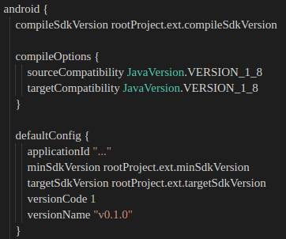

# APK/AAB Generation for DEV

## From Scratch

1. Pull the branch that contains the release code
1. Run `npm install`
1. Place the  [keystore](../file-source/keystore.md) in `android/app` 
1. Place [google-services.json](../file-source/google-services.md) in `android/app`
1. Place the [.env](../file-source/environment-variables.md)  file in the project root
1. Set the appropriate keystore name, password and upload key in `android/gradle.properties`
    - MYAPP_UPLOAD_STORE_FILE=xxx.keystore
    - MYAPP_UPLOAD_KEY_ALIAS=xxx
    - MYAPP_UPLOAD_STORE_PASSWORD=xxx
    - MYAPP_UPLOAD_KEY_PASSWORD=xxx
1. Increment the App Version Number in `android/app/build.gradle` (in `defaultConfig.versionCode/versionName`)

    

1. Make sure you have JDK 8 OpenJDK installed. (jdk8-openjdk for Arch linux)

1. Generate the APK or AAB:
   - To generate an APK, run `npm run generate:apk`
   - To generate an AAB, run `npm run generate:aab`

1. The release will be in `release/DrCannabis-<timestamp>.(apk|aab)`

1. BEFORE DISTRIBUTING: Rename the release to `DrCannabis-<VERSION_NAME>-<timestamp>.(apk|aab)`
