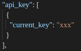
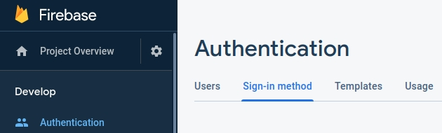
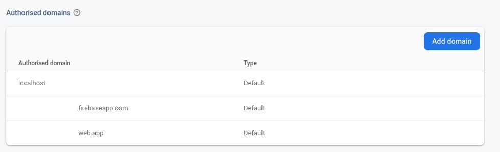
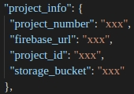
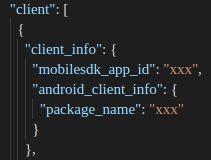
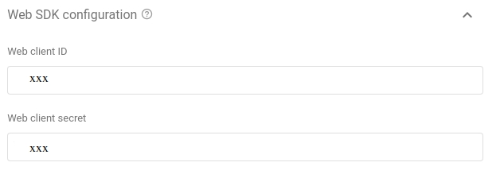
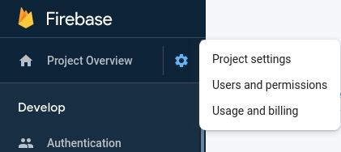
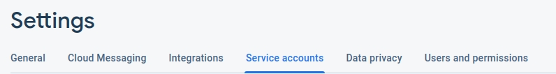

# .env setup

```
API_KEY=xxx  
AUTH_DOMAIN=xxx  
DATABASE_URL=xxx  
PROJECT_ID=xxx  
STORAGE_BUCKET=xxx  
APP_ID=xxx  
PRIVACY_POLICY_URL=xxx  
WEB_CLIENT_ID=xxx  
SIZE_MATTERS_BASE_WIDTH=375  
SIZE_MATTERS_BASE_HEIGHT=670
SERVICE_ACCOUNT_PATH=`serviceAccount-adminsdk.json` 
```

# Where to get each thing

## API_KEY
 - Extract from [google-services.json](./google-services.md)
 
    

## AUTH_DOMAIN

### Go to:
  - Authentication
    - Sign In Methods

         

      - Scroll down to authorized domains. 
      - Copy the `firebaseapp` one

      

## DATABASE_URL, PROJECT_ID, STORAGE_BUCKET

 - Extract from [google-services.json](./google-services.md) (firebase_url, project_id, storage_bucket)
 
   

## APP_ID 

 - Extract from [google-services.json](./google-services.md) (mobilesdk_app_id)

   

## PRIVACY_POLICY_URL

### Go to:

- firebase console
  - hosting
  - It's the URL for the privacy policy. 

## WEB_CLIENT_ID

- You have to have Google Sign In Method enabled in firebase authentication
 - Click on Google Sign In and extract Web client ID

   

## SIZE_MATTERS_BASE_WIDTH=375
## SIZE_MATTERS_BASE_HEIGHT=670

## SERVICE_ACCOUNT_PATH

1. Download service account json file from firebase console

  -  Go to 
      - project overview
        - project settings

     

  - Tap service accounts
     

  - Generate a new key

     
